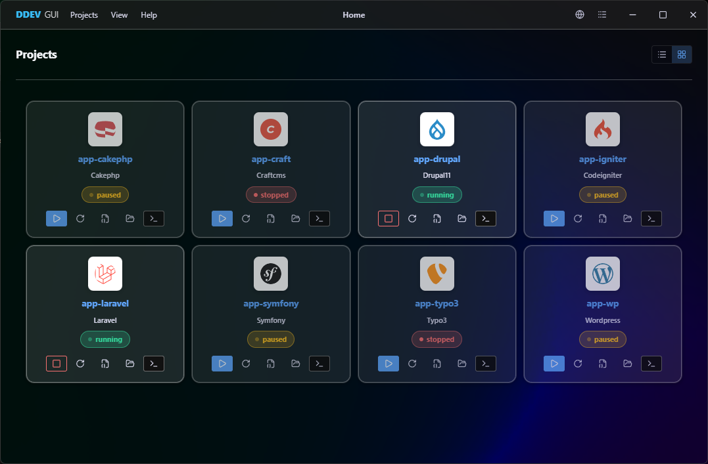
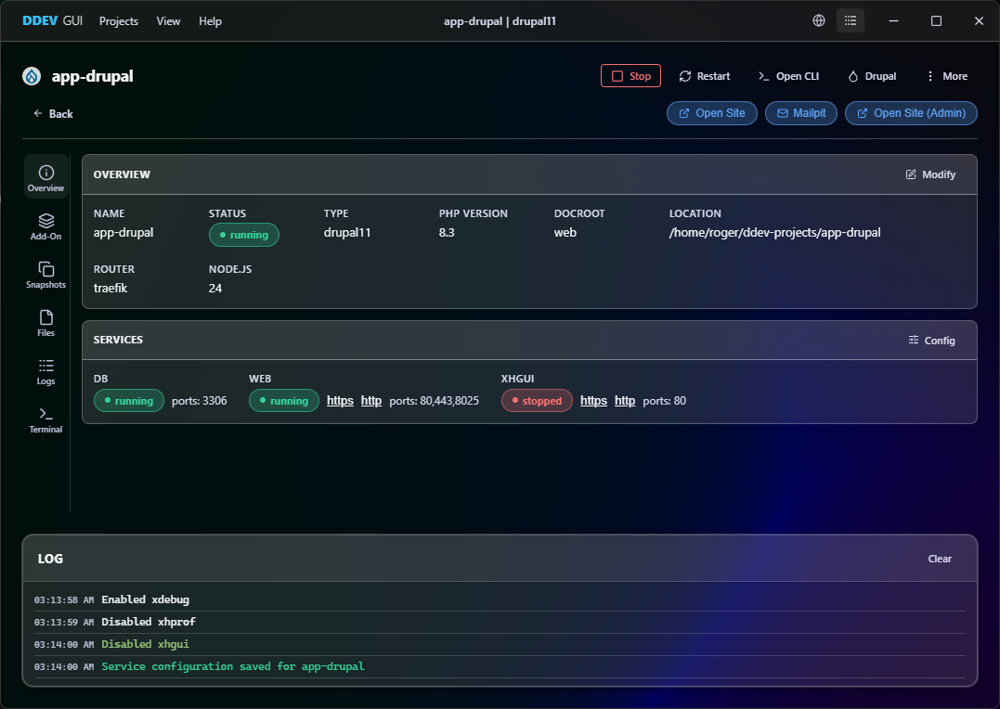
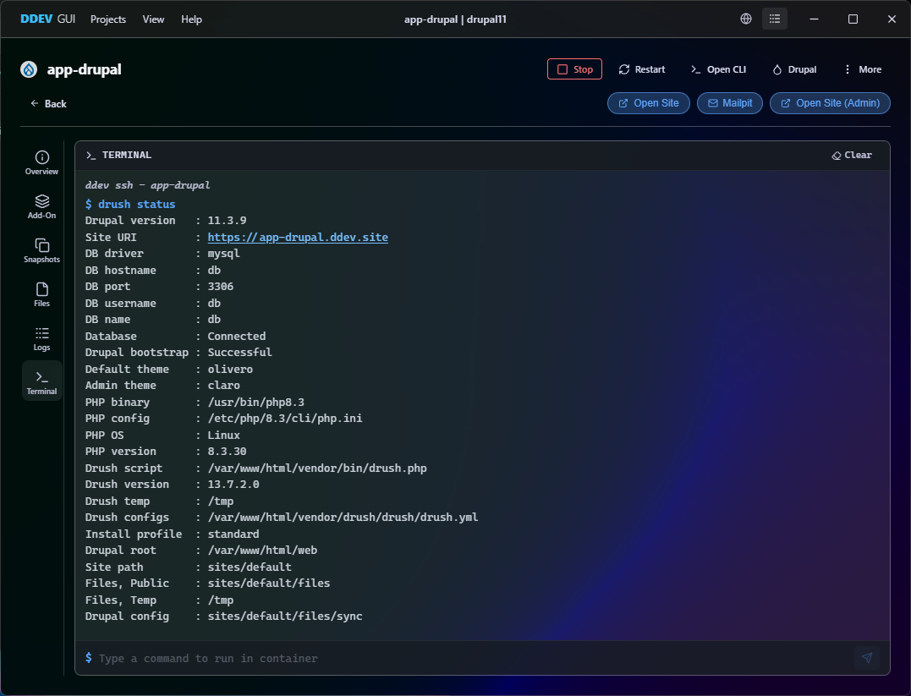

# DDEV GUI

A native desktop application for managing [DDEV](https://github.com/ddev/ddev) projects through an intuitive graphical interface. Built with [Wails v2](https://github.com/wailsapp/wails) (Go + Vue 3 + TypeScript) and styled with a **Fluent UI** design system for a modern Windows 11 look and feel.

## Screenshots
### Project List

### Project Detail

### Terminal


## Features

### Project Management
- **Dashboard** - View all DDEV projects at a glance with live status indicators
- **Lifecycle controls** - Start, Stop, Restart, Delete, and Power Off projects
- **Project detail view** - Inspect services (web, db), URLs, Mailpit access, and installed add-ons
- **New project wizard** - Create and configure new DDEV projects (name, type, docroot, PHP version)
- **Site initialization** - One-click WordPress (`wp core install`) or Drupal (`drush site:install`) setup

### Add-on Management
- Browse and install available DDEV add-ons
- View and remove installed add-ons per project

### Developer Tools
- **Embedded Terminal** - Run commands inside ddev containers without leaving the app
- **Open in Browser** - Quick-launch project URLs
- **DDEV installer** - Download and install DDEV directly from the app (Windows)
- **Command log** - Persistent, color-coded, timestamped output log for all DDEV operations
- **Masquerade** - Easy login as specific users in Drupal projects

### Platform
- **Cross-platform** - Native support for Linux and Windows (via WSL). MacOS support will be added if someone is willing to test
- **WSL-aware** - Automatically routes DDEV commands through `wsl.exe` on Windows
- **SSH backend** - Support for managing DDEV projects on remote servers via SSH
- **Native menu** - OS-level menu bar with keyboard shortcuts for common actions

## Prerequisites

- **Go 1.23+**
- **Node.js 22+** and **npm**
- **Wails CLI** installed and prerequisites met:
  ```
  go install github.com/wailsapp/wails/v2/cmd/wails@latest
  ```
  - Windows: WebView2 Runtime + MSVC build tools
  - Linux: `libgtk-3-dev`, `libwebkit2gtk-4.1-dev`, `pkg-config`
  - See: https://wails.io/docs/gettingstarted/installation
- **DDEV** installed and available on `PATH` (or inside WSL on Windows)
- **[Task](https://taskfile.dev/)** (optional)

## Quick Start

```bash
# Install frontend dependencies
cd frontend
npm install
cd ..

# Development mode (hot-reload)
wails dev

# Production build
wails build
# Binary output: build/bin/ddev-gui (.exe on Windows)
```

## Project Structure

```
├── main.go                 # App entry point, menu, event wiring
├── backend/                # Go backend services
│   ├── ddev.go             # DdevService - all DDEV CLI interactions
│   ├── config.go           # ConfigService - persistent app settings
│   ├── wslshell.go         # Persistent WSL shell for performance
│   ├── sshshell.go         # SSH execution backend
│   ├── drush.go            # Drupal-specific command helpers
│   └── editor.go           # External editor integration
├── frontend/               # Vue 3 + TypeScript frontend
│   ├── src/
│   │   ├── components/     # Reusable UI components
│   │   ├── stores/         # Pinia state management
│   │   ├── lib/            # Utilities and Wails bridge
│   │   └── App.vue         # Main application component
│   └── package.json        # Frontend dependencies and scripts
├── build/                   # Platform assets (icons, manifest)
├── wails.json               # Wails project configuration
└── go.mod / go.sum          # Go module dependencies
```

## Architecture

The app uses **Wails v2 Go bindings** for frontend-to-backend communication. The frontend (Vue 3 + Pinia) calls Go methods directly via a typed bridge. Push notifications from the backend (e.g., streaming command output) use the Wails event bus.

```
Frontend (Vue 3)  ──  Go Bindings  ──  DdevService  ──  ddev CLI
                      Event Bus  ←──  Push notifications (ddev:output)
```

For more details, see [Architecture Documentation](docs/architecture.md).
