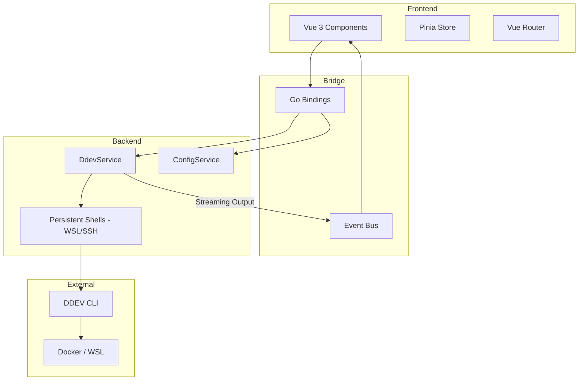

# Architecture

This document describes the high-level architecture of DDEV GUI, a desktop application for managing DDEV projects.

## Technical Stack

*   **Framework**: [Wails v2](https://wails.io/) (Go + Webview bridge)
*   **Backend**: Go 1.23+
*   **Frontend**: Vue 3, TypeScript, Vite
*   **State Management**: Pinia
*   **Routing**: Vue Router
*   **Styling**: Fluent UI-inspired custom CSS

## System Overview

DDEV GUI follows a typical Wails application structure, where a Go-based backend handles system-level operations (CLI execution, file system access, configuration) and a web-based frontend provides the user interface.

## Backend Components

### DdevService (`backend/ddev.go`)
The core service responsible for interacting with the DDEV CLI. It handles:
*   Project lifecycle (start, stop, restart, delete).
*   Add-on management and database operations (import/export, snapshots).
*   Environment diagnostics and automatic DDEV installation (on Windows).
*   File system browsing within projects.

To optimize performance, especially on Windows (WSL), it utilizes **persistent shells**:
*   `WSLShell`: Maintains a background `bash` session to avoid the high latency of spawning `wsl.exe` for every command.
*   `SSHShell`: Provides remote execution capabilities.
*   `runDirect`: Spawns fresh processes for long-running or blocking commands to keep the main shell responsive for UI updates.

### ConfigService (`backend/config.go`)
Manages application persistence:
*   Saves and loads settings to `config.json` in the user's config directory.
*   Handles both global application settings and per-project configurations.
*   Captures and restores window geometry (size, position, maximized state).

## Frontend Components

### State Management (`frontend/src/stores/app.ts`)
The `app` store (Pinia) acts as the single source of truth for:
*   Project list and their current status.
*   Application configuration.
*   Global UI state (active view, modals, toasts).
*   Live log entries and terminal output.

### Routing (`frontend/src/router/`)
The application uses a simple routing structure:
*   **Dashboard**: The main project list (grid or list view).
*   **Project Detail**: Deep dive into a single project, featuring tabs for Overview, Files, Add-ons, Snapshots, and Terminal.

### Wails Bridge (`frontend/src/lib/wails.ts`)
A typed wrapper around the Wails-generated Go bindings. It provides a clean API for components to call backend services and subscribe to events from the Go event bus.

## Communication Flow

1.  **Frontend to Backend (Calls)**: When a user clicks an action (e.g., "Start Project"), the frontend calls a bound Go method via `DdevService`. Wails handles the serialization and transit.
2.  **Backend to Frontend (Events)**: For long-running commands, the backend emits events (e.g., `ddev:output`) containing raw CLI output. The frontend listens for these events to update the log panel and terminal in real-time.
3.  **Data Synchronization**: After most mutating actions, the frontend triggers a `refreshProjects()` call to pull the latest state from `ddev list -j`, ensuring the UI reflects the actual state of the DDEV environment.
